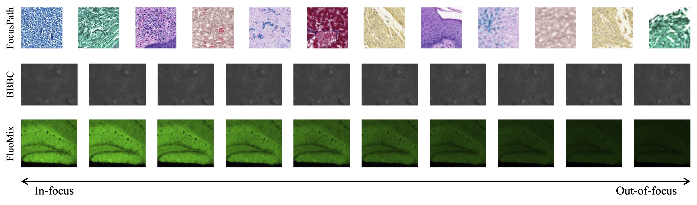
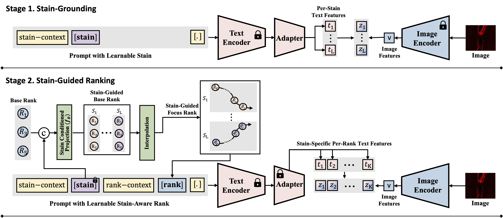
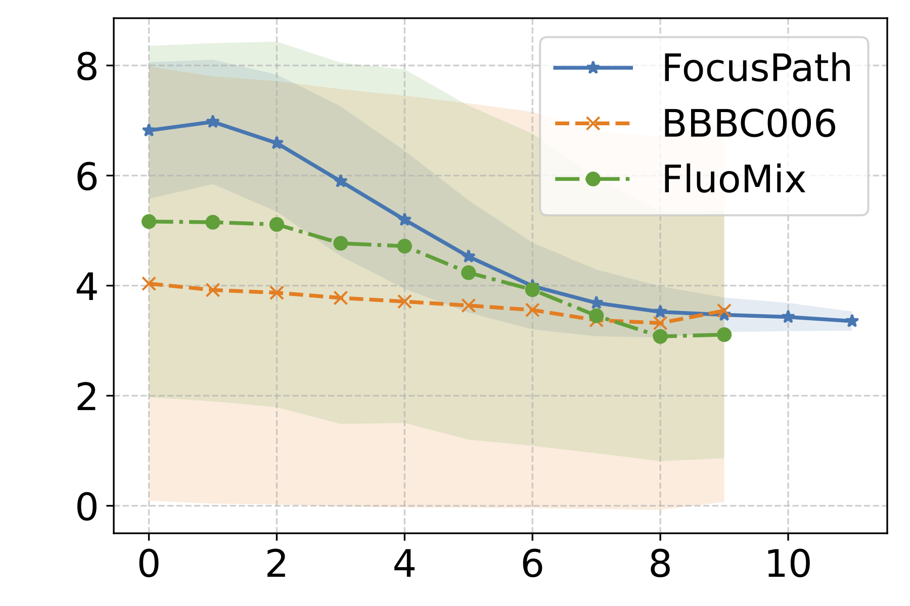
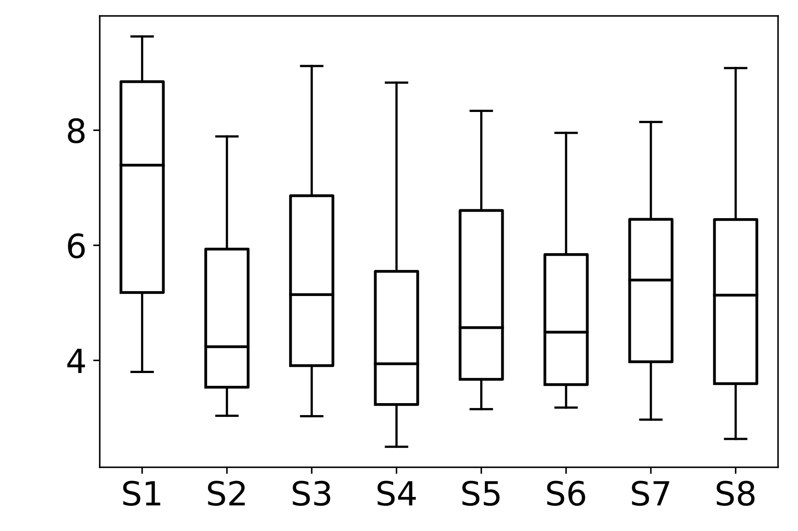
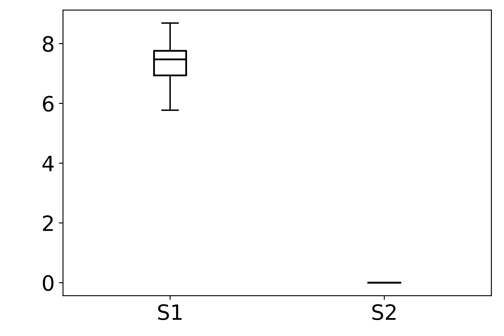
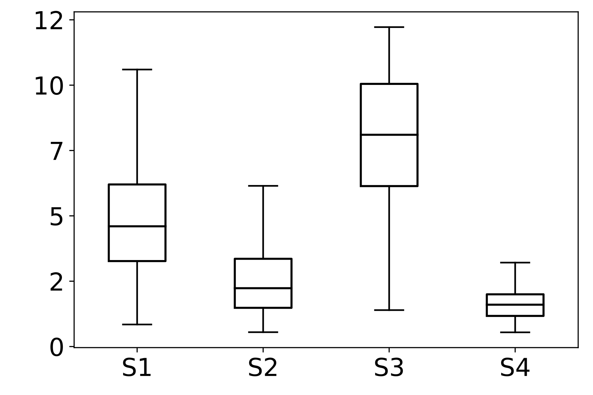

<!-- Using HTML to center the abstract -->
<div class="columns is-centered has-text-centered">
    <div class="column is-four-fifths">
        <h2>Abstract</h2>
        <div class="content has-text-justified">
Accurate focus quality assessment (FQA) in fluorescence microscopy remains challenging, as the stain-dependent optical properties of fluorescent dyes cause abrupt and heterogeneous focus shifts. However, existing datasets and models overlook this variability, treating focus quality as a stain-agnostic problem. In this work, we formulate the task of stain-aware FQA, emphasizing that focus behavior in fluorescence microscopy must be modeled as a function of staining characteristics. Through quantitative analysis of existing datasets (FocusPath, BBBC006) and our newly curated FluoMix, we demonstrate that focus–rank relationships vary substantially across stains, underscoring the need for stain-aware modeling in fluorescence microscopy. To support this new formulation, we propose FluoMix, the first dataset for stain-aware FQA that encompasses multiple tissues, fluorescent stains, and focus variations. Building on this dataset, we propose FluoCLIP, a two-stage vision-language framework that leverages CLIP’s alignment capability to interpret focus quality in the context of biological staining. In the stain-grounding phase, FluoCLIP learns general stain representations by aligning textual stain tokens with visual features, while in the stain-guided ranking phase, it optimizes stain-specific rank prompts for ordinal focus prediction. Together, our formulation, dataset, and framework establish the first foundation for stain-aware FQA, and FluoCLIP achieves strong generalization across diverse fluorescence microscopy conditions.
        </div>
    </div>
</div>

---

## Key Contributions
1. We propose **FluoCLIP**, a two-stage ordinal vision–language framework that learns stain-specific grounding and stain-guided ranking for robust FQA.
2. We introduce **FluoMix**, a new dataset featuring diverse fluorescent stains and tissue-level focus variations, providing the first dataset for stain-aware FQA in fluorescence microscopy.
3. We formulate the task of **Stain-Aware FQA** in fluorescence microscopy, highlighting the need to model stain-dependent focus behavior. 

---

## FluoMix: A Dataset for Stain-Aware FQA
Existing datasets for focus quality assessment are limited in scope and fail to represent the diversity of fluorescence microscopy. To address this, we introduce **FluoMix**, a multi-tissue, multi-stain dataset specifically designed for stain-aware FQA. FluoMix aggregates fluorescence microscopy images across brain, lung, and liver tissues to capture diverse optical and biological characteristics. Each field of view includes up to four distinct stains and is acquired as a complete z-stack (covering the full range from sharp to severely blurred slices). By reflecting the spatial and biological heterogeneity of real tissue specimens, FluoMix establishes a practical foundation for robust, stain-aware focus assessment.

<div class="columns is-centered">
  <div class="column is-half">
    <figure class="image">
      
    </figure>
  </div>
  <div class="column is-half">
    <figure class="image">
      
    </figure>
  </div>
</div>
*Figure 1 : (Left)Examples of dataset classes and (Right)Sample images illustrating stain diversity in the three datasets.*


<div class="container">
  <div class="content">
    <p><strong>Table 1: Overview of the FluoMix dataset.</strong> Each stain is paired with distinct protein markers, reflecting the heterogeneity of signals across tissues.</p>
    <table class="table is-fullwidth is-striped is-hoverable is-narrow">
      <thead>
        <tr style="border-bottom: 2px solid #000;">
          <th colspan="6" class="has-text-centered">Brain Tissue</th>
        </tr>
        <tr>
          <th>Dataset</th>
          <th>Hoechst 34580</th>
          <th>Alexa 488</th>
          <th>Cy3</th>
          <th>Alexa 647</th>
          <th># Sets</th>
        </tr>
      </thead>
      <tbody>
        <tr><td>D1</td><td>nucleus</td><td>Iba-1</td><td>Tuj-1</td><td>Collagen IV</td><td>504</td></tr>
        <tr><td>D2</td><td>nucleus</td><td>NFM</td><td>TH</td><td>Collagen IV</td><td>152</td></tr>
        <tr><td>D3</td><td>nucleus</td><td>NeuN</td><td>TH</td><td>Collagen IV</td><td>554</td></tr>
        <tr><td>D4</td><td>nucleus</td><td>GFAP</td><td>Tuj-1</td><td>CD31</td><td>623</td></tr>
        <tr style="border-top: 2px solid #000;"><th colspan="6" class="has-text-centered">Lung Tissue</th></tr>
        <tr><td>D5</td><td>nucleus</td><td>CD31</td><td>Vimentin</td><td>Collagen IV</td><td>634</td></tr>
        <tr><td>D6</td><td>nucleus</td><td>CD31</td><td>Vimentin</td><td>Collagen IV</td><td>596</td></tr>
        <tr style="border-top: 2px solid #000;"><th colspan="6" class="has-text-centered">Liver Tissue</th></tr>
        <tr><td>D7</td><td>nucleus</td><td>CK19</td><td>Claudin</td><td>ZO-1</td><td>96</td></tr>
      </tbody>
    </table>
  </div>
</div>
---

## FluoCLIP: Stain-Aware FQA Framework
<div class="columns is-centered">
  <div class="column is-three-quarters">
    <figure class="image">
      
      <p class="has-text-centered mt-2"><i>Figure 1: Overview of the FluoCLIP framework, featuring Stage 1 (Stain-Grounding) and Stage 2 (Stain-Guided Ranking).</i></p>
    </figure>
  </div>
</div>

To handle the heterogeneous focus degradation unique to fluorescence imaging, we propose **FluoCLIP**, a two-stage vision-language framework:

1. **Stage 1: Stain-Grounding**: The model aligns learnable stain tokens with CLIP visual representations so that the text encoder acquires fluorescence-specific semantics. We freeze the pretrained text encoder and attach a compact adapter that learns stain-specific attributes, preserving linguistic consistency while enabling domain adaptation.
2. **Stage 2: Stain-Guided Ranking**: The learned stain embeddings are used to condition focus prediction on stain-dependent appearance variations. A conditioning network projects base rank embeddings into a stain-guided space, and intermediate ranks are obtained through interpolation. This allows the model to modulate its focus perception according to the unique characteristics of each fluorophore.

<div class="container mt-5">
  <div class="content">
    <p><strong>Table 2: Ablation study on FluoCLIP components on the FluoMix dataset.</strong> We evaluate the contribution of grounded stain tokens ($S$) and stain-guided rank modules ($\tilde{R}^S$).</p>
    <table class="table is-fullwidth is-bordered is-narrow has-text-centered">
      <thead>
        <tr style="background-color: #f5f5f5;">
          <th>Type</th>
          <th>Configuration</th>
          <th>$S^{\text{plain}}$</th>
          <th>$S^{\text{train}}$</th>
          <th>$S$</th>
          <th>$R$</th>
          <th>$\tilde{R}^S$</th>
          <th>Acc. (%)</th>
          <th>Step Gain</th>
          <th>Total Gain</th>
        </tr>
      </thead>
      <tbody>
        <tr><td>(A)</td><td>Baseline (OrdinalCLIP)</td><td></td><td></td><td></td><td>✓</td><td></td><td>83.12±0.41</td><td>-</td><td>-</td></tr>
        <tr><td>(B)</td><td>(A) + Plain Stain Token</td><td>✓</td><td></td><td></td><td>✓</td><td></td><td>83.21±3.93</td><td>0.09</td><td>-</td></tr>
        <tr><td>(C)</td><td>(A) + Learnable Stain Token</td><td></td><td>✓</td><td></td><td>✓</td><td></td><td>81.38±0.63</td><td>-1.74</td><td>-</td></tr>
        <tr><td>(D)</td><td>(A) + Grounded Stain Token</td><td></td><td></td><td>✓</td><td>✓</td><td></td><td>84.28±0.88</td><td>1.16</td><td>1.16</td></tr>
        <tr><td>(E)</td><td>(D) + Stain-Guided Rank Token</td><td></td><td></td><td>✓</td><td></td><td>✓</td><td>85.21±0.88</td><td>0.93</td><td>2.09</td></tr>
      </tbody>
    </table>
  </div>
</div>

---

## Empirical Analysis of Stain-Dependent Focus Behavior

<div class="columns is-centered">
  <div class="column is-one-quarter">
    <figure class="image">
      
    </figure>
  </div>
  <div class="column is-one-quarter">
    <figure class="image">
      
    </figure>
  </div>
  <div class="column is-one-quarter">
    <figure class="image">
      
    </figure>
  </div>
  <div class="column is-one-quarter">
    <figure class="image">
      
    </figure>
  </div>
</div>
*Figure 2 : Empirical Analysis of Stain-Dependent Focus Behavior: (a) Mean spatial frequency (SF) versus focus rank for three datasets; the shaded region indicates ±1 standard deviation across samples. SF decreases monotonically with increasing rank, confirming that SF reliably captures focus degradation. (b)–(d) Boxplots of SF values across stains for each dataset (x-axis: stain identity, y-axis: SF distribution). FocusPath shows stain-invariant SF trends, wherease BBBC006 and FluoMix display pronounced stain-dependent variability.*

### Spatial Frequency (SF) Metric
In our analysis, we utilize the Spatial Frequency (SF) metric as a quantitative proxy for image sharpness to analyze stain-dependent focus behavior. Higher SF values indicate sharper, more in-focus images. 

Given an image $I \in \mathbb{R}^{M \times N}$, the row frequency ($RF$) and column frequency ($CF$) components are defined as:

$$RF = \sqrt{\frac{1}{(M-1)N} \sum_{i=1}^{M-1}\sum_{j=1}^{N} (I(i+1,j)-I(i,j))^2}$$

$$CF = \sqrt{\frac{1}{M(N-1)} \sum_{i=1}^{M}\sum_{j=1}^{N-1} (I(i,j+1)-I(i,j))^2}$$

The overall Spatial Frequency ($SF$) is then calculated as:

$$SF = \sqrt{RF^2 + CF^2}$$

Source: [Image quality measures and their performance. IEEE Trans. Commun.]([https://ieeexplore.ieee.org/document/477498]).

## Citation
```
@article{park2026fluoclip,
  title={FluoCLIP: Stain-Aware Focus Quality Assessment in Fluorescence Microscopy},
  author={Park, Hyejin and Yoon, Jiwon and Park, Sumin and Kim, Suree and Jang, Sinae and Lee, Eunsoo and Kang, Dongmin and Min, Dongbo},
  journal={arXiv preprint arXiv:2602.23791},
  year={2026}
}
```
